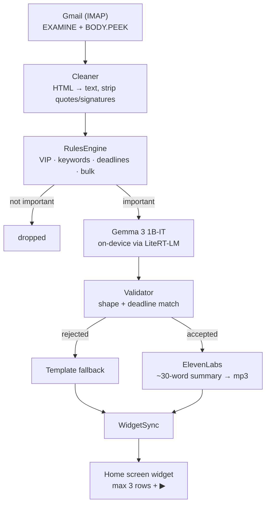

<!--
DRAFT — submission for the Hacktoberfest Weekend Challenge: Build for a Friend.
Publish at https://dev.to/new

Title: I built an app that reads my dyslexic friend's email for him
Tags:  devchallenge, weekendchallenge, hf26challenge

This follows the challenge's official submission template section for section.

BEFORE PUBLISHING:
  1. Replace every ⟦TODO⟧ marker. Two cannot be written until a human acts:
     - The hand-over section (prd.md §9 requires his verbatim reaction).
     - The demo video URL.
  2. Set the AI disclosure level to "Some usage of AI" — this draft was written
     with OpenCode as the pair programmer. DEV requires that field to be
     accurate.
  3. Confirm: no real email content, no screenshots of his actual inbox, no keys.
  4. The privacy sentence must stay the exact approved wording.
  5. If the live IMAP read-only proof gets run before the deadline, replace the
     "not yet proven" limitation with the real result — do not just delete it.
  6. Keep the repo README's "Post-deadline commits" section: the Official Rules
     require commits made after the deadline to be disclosed there.
-->

*This is a submission for the [Hacktoberfest Weekend Challenge: Build for a Friend](https://dev.to/challenges/hacktoberfest-weekend-2026-10-01)*

## What I Built

**Heads Up** is an Android home-screen widget that shows **at most three emails
that actually matter**, as three short plain lines, each with a ▶ button so it
can be listened to instead of read.

I built it for a friend of mine.

He is dyslexic. He is smart and entirely capable of running his own inbox — he
just doesn't, because the inbox is a wall of text and the wall costs him more
than the contents are worth. So important things sit there. A college form with
a deadline. A question from a friend he wanted to answer. Things that would
have taken four minutes, if he'd seen them on the day they arrived.

⟦TODO: replace with one specific moment where he missed something, in his words
if you have them. A real moment beats a general description of the problem.⟧

### The insight

The usual advice for "I can't keep up with email" is filters, rules, priority
inboxes, muting senders. All of it still leaves him doing the reading.

His problem isn't that the inbox is too noisy. It's that **the inbox is somewhere
he has to go.** Nobody walks past their own front door. You have to make a
decision, and deciding is the expensive part.

So: don't make him check it. Bring it to him. Three things on the screen he
already looks at forty times a day, written in the fewest words that still mean
something, and a button instead of a paragraph.

Three items maximum, ever. And when there's nothing, it says
`Nothing needs you today ✓` rather than showing an empty box — an empty widget
gets deleted, and a deleted widget gets missed.

```
┌─────────────────────────────────┐
│  2 things need you today        │
│                                 │
│  ⚠ College form                 │
│  WHAT: Enrollment form deadline │
│  DO:  Submit ID proof           │
│  BY:  Oct 10            ▶       │
│                                 │
│  ● Doctor                        │
│  WHAT: Appointment moved         │
│  DO:  Call to confirm    ▶       │
└─────────────────────────────────┘
```

### Privacy

> Your full emails never leave this phone. Only a short, plain summary is sent
> to ElevenLabs for voice.

Exactly two things leave the device: IMAP traffic to Gmail's own servers, and
the ~30-word summary text when cloud voice is on. Bodies, subjects and senders
stay in a local SQLite database. The app password, the ElevenLabs key and the
Hugging Face token live in Android KeyStore-backed secure storage, and the setup
form never re-displays a stored secret — it shows `•••••••• saved` instead, so a
real credential can't be read over someone's shoulder or captured in a
screenshot.

He can revoke everything at any time: Google Account → Security → App
Passwords → delete "Heads Up". That breaks the app immediately, without
uninstalling it.

I want to be precise rather than reassuring here, because "your data stays
private" has stopped meaning anything. This app **does** talk to a cloud
service. I chose ElevenLabs because his listener experience matters more than my
purity score, I made it switchable, and I said so in the app rather than only
here.

**Read-only means read-only.** IMAP `EXAMINE` plus `BODY.PEEK[]` — it never sets
`\Seen`, so nothing in his Gmail ever shows up as read because of this app. It
cannot send, delete or move mail either.

That guarantee is enforced by a test that greps the source for `selectMailbox`,
`STORE` and `+FLAGS`, and asserts the live value of the fetch constant really
contains `BODY.PEEK[]`. I only trust that test because I tried to break it: an
earlier version passed even with `BODY[]` injected, because a doc comment
mentioning `BODY.PEEK[]` satisfied the assertion. It now reads the constant's
value, and both injections are caught.

## Demo

<!-- ⟦TODO: demo video ⟧ -->

Live on the target phone, verified on hardware:

| | |
|---|---|
| On-device inference | Gemma 3 1B-IT via LiteRT-LM, **2,109 ms** generation (8,714 ms cold, incl. engine init) |
| Widget ▶ button | Verified both paths: ElevenLabs mp3 → `AudioTrack`, and the `flutter_tts` fallback |
| Memory | 774 MB total PSS during inference |

Real output from the run that decided whether to keep the model at all:

```
WHAT: Enrollment form deadline
DO: Submit your ID proof & declaration
BY: Oct 10
```

That `Oct 10` was the date the rules engine had already extracted. I set the
gate at "10 seconds per email, or fall back to a smaller model"; it came in at
8.7 s cold and ~2 s warm, so the 1B model stayed.

⟦TODO: demo video, ideally narrated with ElevenLabs, since the post claims that
category. All content must be fabricated — no real inbox.⟧

## Code



MIT licensed. The README carries the full spec-discrepancy list, the app-size
breakdown, and a table of what is verified on hardware versus unit-tested only.

### How it's put together



1. Fetch new mail over IMAP, **read-only**.
2. A deterministic rules engine decides what matters.
3. Gemma 3 1B-IT, on the phone, rewrites each flagged email into
   `WHAT / DO / BY`.
4. ElevenLabs turns that short summary into an mp3, cached on the device.
5. The widget shows up to three items, each with a play button.

## How I Built It

Open-source AI used, and the specific parts:

- **[Gemma 3 1B-IT](https://huggingface.co/litert-community/Gemma3-1B-IT)** —
  open-weight, running **fully on-device** via
  [`flutter_gemma`](https://pub.dev/packages/flutter_gemma) / LiteRT-LM.
- **[OpenCode](https://opencode.ai)** — the open-source agent harness I built
  the whole thing with.
- **[ElevenLabs](https://elevenlabs.io)** — voice synthesis for the summaries.

Flutter, [`enough_mail`](https://pub.dev/packages/enough_mail) for IMAP,
[`home_widget`](https://pub.dev/packages/home_widget) for the widget bridge,
[`just_audio`](https://pub.dev/packages/just_audio) for playback.

### Two decisions that mattered more than the model

**Importance is never inferred by the AI.** A 1B model asked "is this
important?" will confidently declare a shopping newsletter urgent. So the rules
engine decides — with auditable regex you can read and argue with — and the
model's only job is rewriting text that has already been judged worth showing.
If the rules engine can explain why an email is on the widget, that explanation
survives.

**The model is never allowed to invent a date.** The rules engine extracts
deadlines by regex and hands the value into the prompt. If the model's `BY:`
doesn't match what was extracted, the entire output is **rejected** and a
template is used instead. For someone who might act on a wrong date, a dull
correct line beats a fluent wrong one every time.

### What I got wrong along the way

I wrote three specs before writing any code. They were wrong in seven places,
and I kept a list — the README has all seven with the reasoning.

The one that would have shipped a silently broken app: **my rules spec says to
use whole-word matching, then shows code using `contains`.** With `contains`, the
action word "form" matches *information* and *platform* — so every email
containing the word "information" would have been flagged important, and on a
three-slot home screen widget that pushes out something real. I followed the
prose, because a false positive costs a widget slot.

The best bug I found wasn't in the 20-fixture table at all. `DateTime.weekday`
is 1-based from Monday; my internal weekday-name list was 0-based. So "by
Friday" resolved to whichever day the email happened to arrive. Twenty fixtures
with expected scores all passed, because none crossed a week boundary in a way
that exposed it. One unit test about "by Friday" caught it immediately.

Two of my own bugs were found only by *looking at the phone*: overlapping labels
on the setup screen, and a build script that couldn't execute at all because I'd
named a parameter `-Debug`, which PowerShell already reserves.

## Why Does Open Innovation Matter?

**Gemma running on his phone isn't a nice-to-have here. It's the whole
architecture.**

His inbox has personal things in it — medical, family, college. A cloud LLM
would mean every one of those emails crosses a network to be read, and I'd have
to tell him so. Running a 557 MB open-weight model locally means the most
sensitive step never leaves the device. It also means **$0 per email**, so
there's no meter quietly encouraging him to read fewer of his own messages.

The interesting part is what a *small* model forces you to build. A frontier
model could probably judge importance on its own. A 1B model can't — so the
architecture has to be organised around what the model **can't** do: decide
what's important, and invent a date. Those two jobs are pushed into a
deterministic, readable, unit-tested layer, and the model is left doing the one
thing it's actually good at, which is rewriting text into plainer text.

That's a better shape regardless of model size. The parts that must be right are
verifiable; the part that's good at pattern-matching prose is allowed to be
fuzzy, because a validator stands behind it.

**Where I wasn't open, said plainly:** ElevenLabs is a proprietary cloud API.
It's the voice, it's the part he actually experiences, and a synthetic voice
that sounds like a robot would undercut the entire point of the product. It's
switchable off, and when it's off, his phone's own TTS reads the line. The
networking is restricted to a ~30-word summary — never an email — but it is
still the one place content leaves the device.

## My Agent Session

⟦TODO: agent session link. Save with DevRelay and embed with the `agent_session`
tag, per the challenge page. **Check the transcript for real email content and
any keys before publishing** — uploads are unlisted by default and judges need
"Make Public" to open them.⟧

## Prize Categories

- **Best Use of Gemma** — Gemma 3 1B-IT runs fully on-device via LiteRT-LM and
  rewrites every flagged email, with each output validated against a
  rules-engine-extracted deadline before it is allowed to reach the screen.
- **Best Use of ElevenLabs** — summaries are voiced with ElevenLabs and cached
  as mp3s on the device, so ▶ is instant and works offline.
  ⟦TODO: if the demo video ends up ElevenLabs-narrated, say so here.⟧

## The hand-over

⟦TODO — this cannot be written until the hand-over happens. Per my own plan: his
real words, not a paraphrase. If he was surprised, delighted, confused, or
indifferent, say which. If the reaction is flat, the flat reaction is the
finding. Do not upgrade it into a nice story.⟧

What I do know is what the plan is, and it isn't "set it up for him":

1. Show him what he already missed.
2. **Let him add the people he cares about to the VIP list himself.**
3. Stand back and watch him use it.

Step 2 is the actual product. If he can't tell it who matters, it's a mail
client with extra steps, and I'd rather find that out in the room than in a
screenshot.

## Limitations I'm being honest about

- **Not yet proven against his real inbox.** The widget, the audio and the
  on-device model have all been verified on his actual phone. The IMAP read-only
  proof and ElevenLabs voice generation are unit-tested and built into the app,
  but have not yet been run against the live account. I'd rather say that here
  than let a screenshot imply otherwise.
- **Background refresh is best-effort, and deliberately light-only.** Android's
  Doze mode can delay the job, and the model does not run in the background at
  all — it's too heavy and the process gets killed mid-inference. The scheduled
  job runs mail + rules only, so it refreshes scores but can't add newly
  rewritten rows. Opening the app runs the full pipeline. A fresh install shows
  the empty state until he opens it once.
- **A 1B model is a small model.** It occasionally mis-structures its output.
  Every response is validated against a strict `WHAT/DO/BY` shape and a
  deadline match; failures fall back to a template rather than showing something
  wrong.
- **Inference is not instant.** 8.7 s cold. Fine for a screen that updates on a
  timer; not fine for anything interactive.
- **Android-only, arm64, Android 12+.** Don't run it on an x86_64 emulator — the
  manifest declares that ABI but only arm64 carries real libraries, so the
  install succeeds and then fails to find `libflutter.so`.
- **The APK is 128.7 MB**, mostly native LiteRT-LM libraries. I cut it from
  281 MB with build flags, and deliberately left R8 off: minifying would risk
  breaking the Tink-backed password store to save 20 MB.