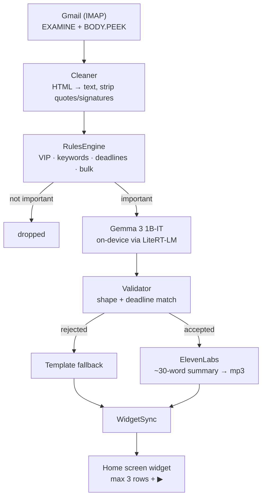

<!--
DRAFT — DEV submission post for the Hacktoberfest Weekend Challenge
("Build for a Friend", DEV Community, Oct 2026).

Publish at https://dev.to/new
Title: I built an app that reads my dyslexic friend's email for him
Tags:  devchallenge, weekendchallenge, hf26challenge

BEFORE PUBLISHING, replace every ⟦TODO⟧ marker. Two of them cannot be written
until a human does something:
  1. The friend's verbatim reaction — the hand-over has not happened yet.
     prd.md §9 requires his real words, not a paraphrase.
  2. The demo video URL.

Then set the AI disclosure level in the DEV editor to "Some usage of AI" — this
draft was written with OpenCode as the pair programmer. DEV's AI guidelines
require this to be accurate, and agent-drafted is exactly what it is.
-->

# I built an app that reads my dyslexic friend's email for him

**Heads Up** is an Android home-screen widget that shows at most three emails
that actually matter, as three short plain lines, each with a ▶ button so he can
listen instead of read.

Repo: <https://github.com/mudit-palvadi/heads-up>
<!-- ⟦TODO: demo video embed — ⟧ -->

---

## The person

I built this for a friend of mine.

He is dyslexic. He is smart, capable, and completely capable of running his own
inbox — he just doesn't, because the inbox is a wall of text and the wall costs
him more than the contents are worth. So important things sit there. A college
form with a deadline. A friend's question he wanted to answer. Things that
would have taken four minutes, if he had seen them on the day they arrived.

⟦TODO: replace with one specific moment where he missed something, in his words
if you have them. A real moment beats a general description of the problem.⟧

## The insight

The usual advice for "I can't keep up with email" is filters, rules, priority
inboxes, muting senders. All of it still leaves him doing the reading.

His problem isn't that the inbox is too noisy. It's that **the inbox is somewhere
he has to go.** Nobody walks past their own front door. You have to make a
decision, and deciding is the expensive part.

So: don't make him check it. Bring it to him. Put three things on the screen he
already looks at forty times a day, written in the fewest words that still mean
something, and let him press a button instead of parsing a paragraph.

## What I built

A home-screen widget, because the widget is the product and the app is only
setup.

<!-- ⟦TODO: screenshot or GIF of the widget, with fake data only ⟧ -->

```
┌─────────────────────────────────┐
│  2 things need you today        │
│                                 │
│  ⚠ College form                 │
│  WHAT: Enrollment form deadline │
│  DO:  Submit ID proof           │
│  BY:  Oct 10            ▶       │
│                                 │
│  ● Doctor                        │
│  WHAT: Appointment moved         │
│  DO:  Call to confirm            │
│                    ▶            │
└─────────────────────────────────┘
```

Three items maximum, ever. And when there's nothing, it says
`Nothing needs you today ✓` rather than showing an empty box — an empty widget
gets deleted, and a deleted widget gets missed.

Each item has a ▶ button. Press it and it speaks.

The text is short on purpose. `Submit ID proof` is not a summary of a college
email; it's the part you'd want if you could only keep one sentence.

## How it works



In plain steps:

1. The app fetches new mail over IMAP, **read-only**.
2. A deterministic rules engine decides what matters.
3. Gemma 3 1B-IT, running on the phone, rewrites each flagged email into
   `WHAT / DO / BY`.
4. ElevenLabs turns that short summary into an mp3, cached on the device.
5. The widget shows up to three items, each with a play button.

### Two decisions that mattered more than the model

**Importance is never inferred by the AI.** A 1B model asked "is this
important?" will confidently declare a shopping newsletter urgent. So the rules
engine decides — with auditable regex you can read and argue with — and the
model's only job is rewriting text that has already been judged worth showing.
If the rules engine can explain why an email is on the widget, that explanation
survives.

**The model is never allowed to invent a date.** The rules engine extracts
deadlines by regex and hands the value into the prompt. If the model's `BY:`
doesn't match what was extracted, the whole output is **rejected** and a
template is used instead. For someone who might act on a wrong date, a dull
correct line beats a fluent wrong one every time.

### Measured on his actual phone

realme RMX3853 · Android 16 · arm64-v8a · 7.4 GB RAM

| | |
|---|---|
| Model | `gemma3-1b-it-int4.litertlm`, 557 MB, downloaded once |
| Cold latency (incl. engine init) | 8,714 ms |
| Generation only | 2,109 ms |
| — time to first token | 1,222 ms |
| RAM during inference | 774 MB total PSS |

Real output from the run that decided whether to keep the model at all:

```
WHAT: Enrollment form deadline
DO: Submit your ID proof & declaration
BY: Oct 10
```

That `Oct 10` was the date the rules engine had already extracted. I set the
gate at "10 seconds per email or fall back to a smaller model"; it came in at
8.7 s cold and ~2 s warm, so the 1B model stayed.

## Privacy

> Your full emails never leave this phone. Only a short, plain summary is sent
> to ElevenLabs for voice.

Exactly two things leave the device: IMAP traffic to Gmail's own servers, and
the ~30-word summary text when cloud voice is on. Bodies, subjects and senders
stay in a local SQLite database. The app password, the ElevenLabs key and the
Hugging Face token go into Android KeyStore-backed secure storage, and are
never committed.

He can revoke everything at any time: Google Account → Security → App
Passwords → delete "Heads Up". That breaks the app immediately, without
uninstalling it.

I want to be precise rather than reassuring here, because "your data stays
private" is a phrase that has stopped meaning anything. This app **does** talk
to a cloud service. I chose ElevenLabs because his listener experience matters
more than my purity score, I made it switchable, and I said so in the app
rather than only here.

**Read-only means read-only.** IMAP `EXAMINE` plus `BODY.PEEK[]` — it never sets
`\Seen`, so nothing in his Gmail ever shows up as read because of this app. It
cannot send, delete or move mail either.

That guarantee is enforced by a test that greps the source for `selectMailbox`,
`STORE` and `+FLAGS`, and asserts the live value of the fetch constant really
contains `BODY.PEEK[]`. I only trust that test because I tried to break it:
an earlier version passed even with `BODY[]` injected, because a doc comment
mentioning `BODY.PEEK[]` satisfied the assertion. It now reads the constant's
value, and both injections are caught.

## What I got wrong along the way

I wrote three specs before writing any code. They were wrong in seven places,
and I kept a list.

The one that would have shipped a silently broken app: **`rules.md` says to use
whole-word matching, then shows code using `contains`.** With `contains`, the
action word "form" matches *information* and *platform*. Every email containing
the word "information" would have been flagged important — which on a home
screen widget means it pushes out something real. I followed the prose, because
a false positive costs a widget slot and §1 of my own spec says to prefer false
negatives.

The other six are in the README with the reasoning, including two places where
the spec contradicts itself and a fixture that its own pattern can't match.

The best bug I found wasn't in the fixture table at all. `DateTime.weekday` is
1-based from Monday; my internal weekday-name list was 0-based. So "by Friday"
resolved to whichever day the email happened to arrive. Twenty fixtures with
expected scores all passed, because none of them crossed a week boundary in a
way that exposed it. One unit test about "by Friday" caught it immediately.

## Honest limitations

- **Background refresh is best-effort, and deliberately light-only.** Android's
  Doze mode can delay the job, and the model does not run in the background at
  all — it's too heavy and the process gets killed mid-inference. The scheduled
  job runs mail + rules only, so it refreshes scores but can't add newly
  rewritten rows. Opening the app runs the full pipeline. A fresh install shows
  the empty state until he opens it once.
- **A 1B model is a small model.** It occasionally mis-structures its output.
  Every response is validated against a strict `WHAT/DO/BY` shape and a
  deadline match; failures fall back to a template rather than showing
  something wrong.
- **Inference is not instant.** 8.7 s cold. Fine for a screen that updates on a
  timer; not fine for anything interactive.
- **Not yet proven against his real inbox.** The widget, the audio, and the
  on-device model have all been verified on his phone. The IMAP read-only proof
  and ElevenLabs voice generation are unit-tested and built into the app, but
  have not yet been run against the live account. I'd rather say that here than
  let a screenshot imply otherwise.
- **Android-only, arm64, Android 12+.** Don't run it on an x86_64 emulator: the
  manifest declares that ABI but only arm64 carries real libraries, so the
  install succeeds and then fails to find `libflutter.so`.

## The hand-over

⟦TODO — this section cannot be written until the hand-over happens. Per my own
plan: his real words, not a paraphrase. If he was surprised, delighted,
confused, or indifferent, say which. If the reaction is flat, the flat reaction
is the finding. Do not upgrade it into a nice story.⟧

What I do know is what the plan is, and it isn't "set it up for him":

1. Show him what he already missed.
2. **Let him add the people he cares about to the VIP list himself.**
3. Stand back and watch him use it.

Step 2 is the actual product. If he can't tell it who matters, it's a mail
client with extra steps, and I'd rather find that out in the room than in a
screenshot.

## Why open innovation mattered here

**Gemma 3 1B-IT runs on his phone, not on a server.** That isn't a nice-to-have
here. His inbox has personal things in it — medical, family, college. A cloud
LLM would mean every one of those emails crosses a network to be read, and I'd
have to tell him so. Running a 557 MB open-weight model locally means the
sensitive step never leaves. It also means $0 per email, so there's no meter
running that quietly encourages reading fewer of his own messages.

The interesting constraint is that a small model **needs** the rules engine in
front of it. A frontier model could probably judge importance on its own. A 1B
model can't, so the architecture has to be built around what the model *can't*
do — decide what's important, and invent a date. That's a better shape anyway:
the parts that must be right are deterministic and readable, and the part that's
good at pattern-matching text does the text.

ElevenLabs is the one piece that isn't open, and I'm not going to pretend
otherwise. It's the voice, it's the part he actually experiences, and a
synthetic voice that sounds like a robot would undercut the whole point. It's
switchable off, and when it's off, his phone's own TTS reads the line.

## Prize categories

- **Best Use of Gemma** — Gemma 3 1B-IT runs fully on-device via LiteRT-LM and
  rewrites every flagged email, with output validated against a
  rules-engine-extracted deadline before it is allowed to reach the screen.
- **Best Use of ElevenLabs** — summaries are voiced with ElevenLabs, cached as
  mp3s on the device so ▶ is instant and works offline. ⟦TODO: demo video
  narration, if I end up recording one.⟧

## My agent session

⟦TODO: agent session link, if shareable. Check the transcript for real email
content and any keys before uploading — DEV uploads are unlisted by default and
judges need "Make Public" to open them.⟧

---

## Notes for myself, delete before publishing

- Check: no real email content, no screenshots of his inbox, no keys.
- Check: the privacy sentence is the exact approved wording.
- Check: the "not yet proven against his real inbox" limitation stays in. If the
  live proof does get run before the deadline, replace it with the real result
  rather than deleting the line.
- The repo README carries the full spec-discrepancy list and the test breakdown.