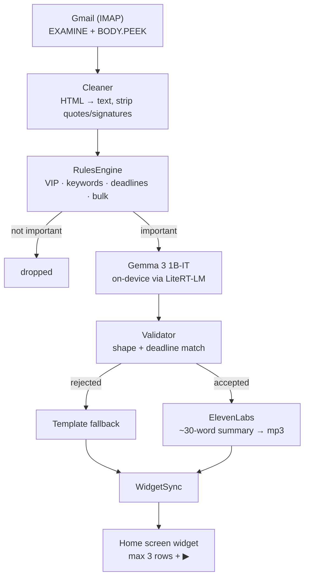

<!--
SUBMISSION DRAFT — Hacktoberfest Weekend Challenge: Build for a Friend
Publish at https://dev.to/new

Title: I built an app that reads my dyslexic friend's email for him
Tags:  devchallenge, weekendchallenge, hf26challenge
AI disclosure: set to "Some usage of AI" — written with OpenCode as pair programmer.

DevRelay MCP was NOT connected this session, so:
  - this could not be staged as a draft via create_article
  - the live challenge page could not be fetched for the exact template
    (the template used here is the one pasted into the conversation)
  - no agent session could be saved; see the placeholder below

BEFORE PUBLISHING, replace every ⟦TODO⟧. Three cannot be written by me:
  1. The hand-over section — has not happened. Do NOT invent a reaction.
  2. Demo video URL.
  3. Agent session link, if you save one.

Then verify: no real email content, no screenshots of a real inbox, no keys.
-->

*This is a submission for the [Hacktoberfest Weekend Challenge: Build for a Friend](https://dev.to/challenges/hacktoberfest-weekend-2026-10-01)*

## What I Built

**Heads Up** — an Android home-screen widget that shows **at most three emails
that actually matter**, as three short plain lines, each with a ▶ button so it
can be listened to instead of read.

I built it for a friend of mine.

He is dyslexic. He is smart and entirely capable of running his own inbox — he
just doesn't, because the inbox is a wall of text and the wall costs him more
than the contents are worth. So important things sit there. A college form with
a deadline. A question from a friend he wanted to answer. Things that would
have taken four minutes, if he'd seen them on the day they arrived.

⟦TODO: replace with one specific moment where he missed something, in his words
if you have them. A real moment beats a general description of the problem.⟧

### The insight

The usual advice for "I can't keep up with email" is filters, rules, priority
inboxes, muting senders. All of it still leaves him doing the reading.

His problem isn't that the inbox is too noisy. It's that **the inbox is
somewhere he has to go.** Nobody walks past their own front door. You have to
make a decision, and deciding is the expensive part.

So: don't make him check it. Bring it to him. Three things on the screen he
already looks at forty times a day, written in the fewest words that still mean
something, and a button instead of a paragraph.

Three items maximum, ever. And when there's nothing, it says
`Nothing needs you today ✓` rather than showing an empty box — an empty widget
gets deleted, and a deleted widget gets missed.

```
┌─────────────────────────────────┐
│  2 things need you today        │
│                                 │
│  ⚠ College form                 │
│  College form                   │
│  Submit ID proof  •  by Oct 10  │
│                           ▶     │
│                                 │
│  ● Doctor                        │
│  Appointment moved               │
│  Call to confirm           ▶     │
└─────────────────────────────────┘
```

## Demo

<!-- ⟦TODO: demo video ⟧ -->

Measured on the target phone (realme RMX3853, Android 16, arm64-v8a):

| | |
|---|---|
| On-device inference | Gemma 3 1B-IT via LiteRT-LM — **2,109 ms** generation, 8,714 ms cold |
| RAM during inference | 774 MB total PSS |
| Widget ▶ → audio | mp3 path verified reaching `AudioTrack` |
| APK | 128.7 MB, down from 281.1 MB |

Real output from the run that decided whether to keep the model at all:

```
WHAT: Enrollment form deadline
DO: Submit your ID proof & declaration
BY: Oct 10
```

`Oct 10` was the date a deterministic rules engine had already extracted. I set
the gate at "10 seconds per email, or fall back to a smaller model"; it came in
at 8.7 s cold and ~2 s warm, so the 1B model stayed.

⟦TODO: video, fabricated content only. If you narrate it with ElevenLabs, say so
in the prize section.⟧

## Code



MIT licensed. 32 commits, 277 tests, `flutter analyze` clean under
`strict-casts` / `strict-inference` / `strict-raw-types`.



## How I Built It

- **[Gemma 3 1B-IT](https://huggingface.co/litert-community/Gemma3-1B-IT)** —
  open-weight, running **fully on-device** via
  [`flutter_gemma`](https://pub.dev/packages/flutter_gemma) / LiteRT-LM.
- **[OpenCode](https://opencode.ai)** — the open-source agent harness I built
  the whole thing with.
- **[ElevenLabs](https://elevenlabs.io)** — voice synthesis for the summaries.
- Flutter, [`enough_mail`](https://pub.dev/packages/enough_mail) for IMAP,
  [`home_widget`](https://pub.dev/packages/home_widget),
  [`just_audio`](https://pub.dev/packages/just_audio).

### Two decisions that mattered more than the model

**Importance is never inferred by the AI.** A 1B model asked "is this
important?" will confidently declare a shopping newsletter urgent. So the rules
engine decides — with auditable regex you can read and argue with — and the
model's only job is rewriting text already judged worth showing. If the rules
engine can explain why an email is on the widget, that explanation survives.

**The model is never allowed to invent a date.** The rules engine extracts
deadlines by regex and hands the value to the prompt. If the model's `BY:`
doesn't match, the entire output is **rejected** and a template is used
instead. For someone who might act on a wrong date, a dull correct line beats a
fluent wrong one every time.

## Why Does Open Innovation Matter?

**Gemma running on his phone isn't a nice-to-have. It's the whole
architecture.**

His inbox has personal things in it — medical, family, college. A cloud LLM
would mean every one of those emails crosses a network to be read, and I'd have
to tell him so. Running a 557 MB open-weight model locally means the most
sensitive step never leaves the device. It also means **$0 per email**, so
there's no meter quietly encouraging him to read fewer of his own messages.

The interesting part is what a *small* model forces you to build. A frontier
model could probably judge importance on its own. A 1B model can't — so the
architecture gets organised around what the model **can't** do: decide what
matters, and invent a date. Those two jobs are pushed into a deterministic,
readable, unit-tested layer, and the model is left doing the one thing it's
good at, rewriting text into plainer text.

That's a better shape regardless of model size: the parts that must be right are
verifiable, and the part that's good at pattern-matching prose is allowed to be
fuzzy because a validator stands behind it.

**Where I wasn't open, said plainly:** ElevenLabs is a proprietary cloud API.
It's the voice — the part he actually experiences — and a synthetic voice that
sounds like a robot would undercut the whole point. It's switchable off, and
when it's off his phone's own TTS reads the line. The network call carries a
~30-word summary, never an email, but it is still the one place content leaves
the device.

## The part I'm actually proud of: my tests were lying to me

This is the part I didn't expect to be the story.

I wrote three "guard" tests that were supposed to defend the central privacy
claim — that the app can never mark an email read. All three were green. All
three were worthless.

They asserted things about the **source text** rather than the **value the
program actually uses**:

```dart
expect(source, contains("'UID FLAGS'"));           // ✓ any mention passes
expect(source, contains('BODY.PEEK[]'));           // ✓ a doc comment passes
expect(source.indexOf('_saveAll()') > tryStart);   // ✓ a comment passes
```

A test can be green and prove nothing, and I had three of them guarding the one
thing `prd.md` called non-negotiable. I only found out because I ran the app on
a real phone, where a comment can't help.

Then, once I had real diagnostics, the bugs arrived:

1. **The INBOX descriptor couldn't be constructed.** I'd passed
   `flags: const <MailboxFlag>[]`, and `enough_mail`'s constructor *mutates* that
   list. Every IMAP read path threw. **The app could not read mail at all** — and
   all 237 tests were green.
2. **The FLAGS probe sent an invalid IMAP command.** I'd asked for `UID` as a
   FETCH data item, which RFC 3501 doesn't allow; Gmail replied `BAD Could not
   parse command`.
3. **The fetch criteria weren't parenthesised.** `enough_mail` documents them as
   `'(ENVELOPE BODY.PEEK[])'`. Gmail rejected the bare form.
4. **The proof reported "read-only: VERIFIED" when it had verified nothing.**
   Every failure path left the counters at `0`, and the verdict read those
   counters. A failed run rendered a green tick.
5. **A proof over zero messages reported PASS.** "No message became read" across
   an empty sample is an absence of evidence, not evidence.
6. **The probe built a UID FETCH range from a message *count*.** On a mailbox
   whose UIDs run into the tens of thousands, it asked for UIDs that don't exist
   — and reported an empty population while the inbox was full.

The worst one was #4. Two commits earlier, the panel would have shown a calm
green **"Read-only: verified"** on a run where the guarantee had not been
measured at all. Had I trusted that screenshot, I'd have published a fabricated
privacy claim about a real person's inbox.

The fix that mattered most wasn't any single bug — it was changing the verdict
from *inferred from loose counters* to an explicit stage the code sets
deliberately, so the display can't be derived into a wrong answer. Green became
reachable only from a fully completed run over a non-empty population.

And the mistake I'd flag to anyone doing this: at one point I concluded the
mailbox was simply empty, and was about to write that up as the finding. The
user asked whether the account actually had mail. One sentence of fact turned a
dead end into bug #6.

## Limitations I'm being honest about

- **The read-only guarantee is enforced by construction and unit-tested, but not
  yet measured on a populated mailbox.** The fix for the last blocker is
  installed; the run is pending. I'm not claiming it until the panel prints a
  non-zero examined count.
- **TTS from the widget is currently not working.** The mp3 → `AudioTrack` path
  is verified. The offline `flutter_tts` fallback is wired end to end and is not
  yet working on the device — undiagnosed, and I ran out of runway before I
  could read the logs.
- **ElevenLabs voice generation has never run against a live key.** The request
  shape, payload cap and quota caching are unit-tested; no real call has been
  made from the phone.
- **The full pipeline has never completed end to end.** `runFull` is unit-tested
  with fakes only. The widget is currently showing fabricated rows from a
  diagnostic harness, which is exactly what `runLight`/`runFull` would replace.
- **Background refresh is best-effort and light-only.** Android's Doze mode can
  delay the job, and Gemma never runs in the background — too heavy, and the
  process gets killed mid-inference. Opening the app runs the full pipeline. A
  fresh install shows the empty state until the app is opened once.
- **Inference is not instant.** 8.7 s cold.
- **Android-only, arm64, Android 12+.** Not x86_64 emulators — the manifest
  declares that ABI but only arm64 carries real libraries.
- **The APK is 128.7 MB**, mostly native LiteRT-LM. I cut it from 281 MB with
  build flags and deliberately left R8 off: minifying would risk breaking the
  Tink-backed password store to save 20 MB.

## Prize Categories

- **Best Use of Gemma** — Gemma 3 1B-IT runs fully on-device via LiteRT-LM and
  rewrites every flagged email, with each output validated against a
  rules-engine-extracted deadline before it's allowed to reach the screen.
- **Best Use of ElevenLabs** — summaries are voiced with ElevenLabs and cached as
  mp3s on the device so ▶ is instant and works offline.
  ⟦TODO: only claim the video narration if you actually record one.⟧

## My Agent Session

⟦TODO: DevRelay wasn't connected this session, so nothing was saved. If you
connect it, save the session and embed with the `agent_session` tag per the
challenge page. **Check the transcript for real email content and any keys
first** — uploads are unlisted by default and judges need "Make Public".⟧

## The hand-over

⟦TODO — this has not happened yet, and I would rather leave it empty than invent
it. Per my own plan: his real words, not a paraphrase. If he was surprised,
delighted, confused, or indifferent, say which. If the reaction is flat, the flat
reaction is the finding.⟧

What I do know is what the plan is, and it isn't "set it up for him":

1. Show him what he already missed.
2. **Let him add the people he cares about to the VIP list himself.**
3. Stand back and watch him use it.

Step 2 is the actual product. If he can't tell it who matters, it's a mail
client with extra steps, and I'd rather find that out in the room than in a
screenshot.

## Built with

[Gemma 3 1B-IT](https://huggingface.co/litert-community/Gemma3-1B-IT) ·
[ElevenLabs](https://elevenlabs.io) · [OpenCode](https://opencode.ai) ·
Flutter · [enough_mail](https://pub.dev/packages/enough_mail) ·
[home_widget](https://pub.dev/packages/home_widget) ·
[just_audio](https://pub.dev/packages/just_audio) ·
[flutter_tts](https://pub.dev/packages/flutter_tts) ·
[flutter_secure_storage](https://pub.dev/packages/flutter_secure_storage)